# Proyecto 1

## Requerimientos Funcionales

### RF-1. API Gateway
- RF-1.1 El Backend debe exponer las rutas REST para el frontend.
- RF-1.2 Se debe hacer uso y validar tokens JWT.
- RF-1.3 Se debe autorizar el acceso según los roles de cada usuario.
- RF-1.4 Enrutar las peticiones a los servicios de gRPC.

### RF-2. Login y Autentificación
- RF-2.1 Los usuarios podrán registrarse proporcionando: email, contraseña y rol.
- RF-2.2 Los usuarios existentes pueden ingresar a la plataforma utilizando su email y contraseña.
- RF-2.3 Después de autentificar, el servicio genera un JSON Web Token (JWT) que contiene la información relevante del usuario.
- RF-2.4 Se valida el acceso según el rol de cada usuario.

### RF-3. Catálogo del Restaurante
- RF-3.1 El administrador puede crear, leer, actualizar y eliminar restaurantes dentro de la plataforma.
- RF-3.2 El rol de restaurante puede crear, leer, actualizar y eliminar los ítems de menú asociados a cada restaurante.
- RF-3.3 Los clientes pueden ver un listado de restaurantes con su información: nombre, tipo de comida, horario y calificación.
- RF-3.4 Los clientes pueden ver el menú del restaurante seleccionado, mostrando productos activos, precios y descripciones.

### RF-4. Órdenes
- RF-4.1 El cliente puede llenar un carrito con artículos para generar órdenes que se envíen al restaurante.
- RF-4.2 El cliente puede cancelar sus órdenes.
- RF-4.3 El restaurante puede visualizar, aceptar y marcar órdenes como EN PROCESO y LISTA.
- RF-4.4 El restaurante puede rechazar órdenes notificando al cliente.

### RF-5. Envíos y Entrega
- RF-5.1 Los repartidores pueden aceptar órdenes LISTA para cambiar su estado a EN CAMINO.
- RF-5.2 Los repartidores pueden marcar órdenes como ENTREGADA o CANCELADA.

### RF-6. Notificaciones
- RF-6.1 Al crear una orden, el cliente recibe un correo con: nombre del cliente, número de orden, productos, monto total, fecha y estado (CREADA).
- RF-6.2 Al cancelar una orden, el cliente recibe notificación con: quién canceló, número de orden, productos, fecha de cancelación y estado (CANCELADA).
- RF-6.3 Cuando la orden está EN CAMINO, el cliente recibe correo con: nombre del repartidor, número de orden, productos y estado.
- RF-6.4 Cuando el restaurante rechaza una orden, el cliente recibe correo con: nombre del restaurante, número de orden, productos y estado (RECHAZADA).

## Requerimientos no Funcionales

### RNF-1. Rendimiento
- RNF-1.1 El sistema debe soportar múltiples peticiones y operaciones simultáneas.
- RNF-1.2 La actualización de productos y estados ocurre en tiempo real.

### RNF-2. Seguridad
- RNF-2.1 Las contraseñas deben estar cifradas.
- RNF-2.2 La comunicación debe realizarse bajo protocolo HTTPS.
- RNF-2.3 La información personal cumple con normativas de protección de datos.
- RNF-2.4 Se valida autenticación y autorización por rol.

### RNF-3. Escalabilidad
- RNF-3.1 El sistema debe permitir integración de nuevos restaurantes sin rediseños significativos.
- RNF-3.2 La arquitectura debe ser modular para incorporar nuevas funcionalidades.

### RNF-4. Disponibilidad
- RNF-4.1 El sistema debe estar disponible 24/7 con tolerancia a fallos mínima.
- RNF-4.2 Se implementan respaldos automáticos de información crítica.

### RNF-5. Usabilidad
- RNF-5.1 La interfaz debe ser intuitiva, accesible y responsive.
- RNF-5.2 El flujo de registro y orden completarse en máximo 5 pasos.
- RNF-5.3 UX amigable con el usuario.

### RNF-6. Mantenibilidad
- RNF-6.1 El código debe estar documentado y seguir buenas prácticas.
- RNF-6.2 Se aplican patrones de diseño y arquitectura.

### RNF-7. Compatibilidad
- RNF-7.1 Accesible desde navegadores modernos.
- RNF-7.2 Soporta integración con aplicaciones móviles.

## Base de datos 

### Micro servicio Usuarios: Tabla Usuario

- Id: Identificador único del usuario dentro del sistema. (Llave primaria)
- Email (no repetido): Correo electrónico del usuario, utilizado como credencial principal para el inicio de sesión. 
- Contraseña (encriptada): Clave de acceso almacenada siempre de forma segura (encriptada/hasheada) para proteger la información del usuario. 
- Rol: Define el tipo de usuario dentro de la plataforma (CLIENTE, RESTAURANTE, REPARTIDOR, ADMINISTRADOR) y determina los permisos de acceso a las distintas funcionalidades.

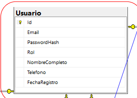

### Micro servicio Restaurante: Tabla Restaurante
- Id: Identificador usuario. (Llave primaria, llave foranea)
- Nombre 
- dirección
- horarios de atención
- numero

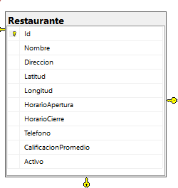

### Micro servicio Catalogo: Producto
- Id (Llave primaria)
- Nombre del platillo 
- descripción 
- precio 
- disponibilidad (Booleano)
- Referencia a Restaurante

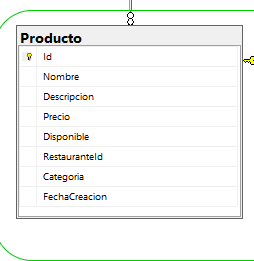

### Micro servicio Orden: Orden
- Id (Llave Primaria)
- Estado (RECHAZADA, CANCELADA, EN CAMINO, CREADA, EN PROCESO, TERMINADA/LISTA, ENTREGADA)
- FechaHoraCreacion
- IdRepartidor (puede ser NULL)

### Orden Cancelada
- IdOrden (LLave foranea, llave primaria)
- FechaCancelacion

### OrdenItem
- Id (llave primaria)
- IdOrden (Llave forarena)
- IdProducto (Llave forarena)

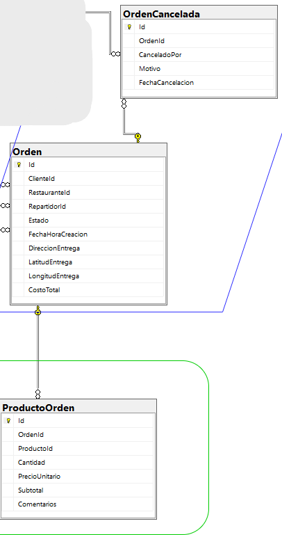

## Logs de pruebas

En este espacio de documentación se muestran los resultados de los logs de pruebas que se hicieron para comprobar el funcionamiento de la creación de ordenes de envio por parte del usuario cliente.

## Logs de Fallo

### Fallo 1: 

Este fallo muestra en Postman lo que pasa cuando se intenta hacer una petición con cantidad 0 de un producto

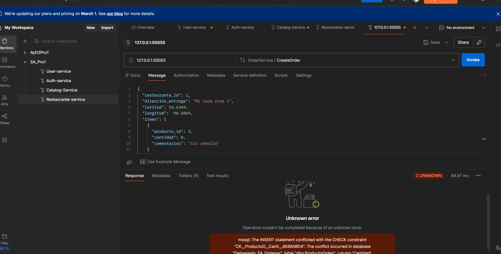

### Fallo 2: 

En este caso es cuando se intenta hacer una orden pero no hay items en el listado de productos pedidos. 
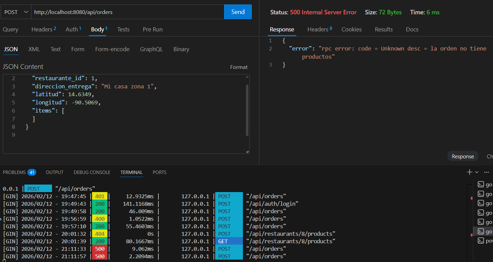

### Fallo 3: 

Este ocurre cuando el producto que se mando a llamar no existe en la base de datos segun su id

### Fallo 4: 

Este es el fallo que se muestra desde thunder Client, extension de VS code, Ocurre cuando se hace el pedido de un producto que no esta dispoble. 

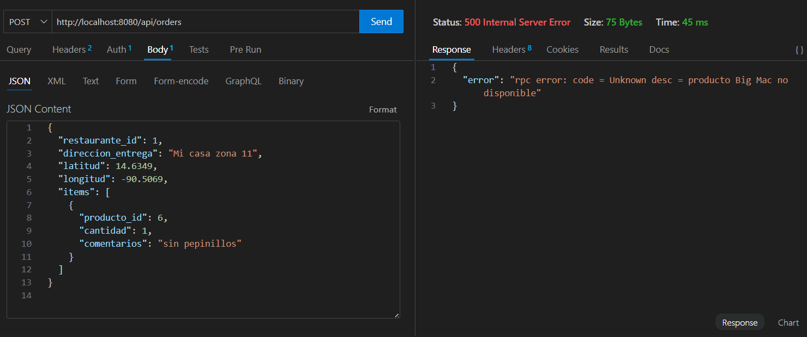

### Fallo 5:

Este fallo ocurre cuando en el listado de productos se ingresan unos que son de diferentes restaurantes. Opcion la cual no esta permitida

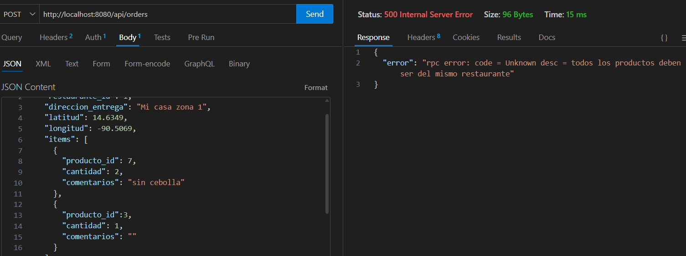

## Logs de Exito

### Exito 1: 

En este caso se hizo la prueba desde el api-gateaway con dos productos del mismo restaurante uno con y el otro sin comentario.

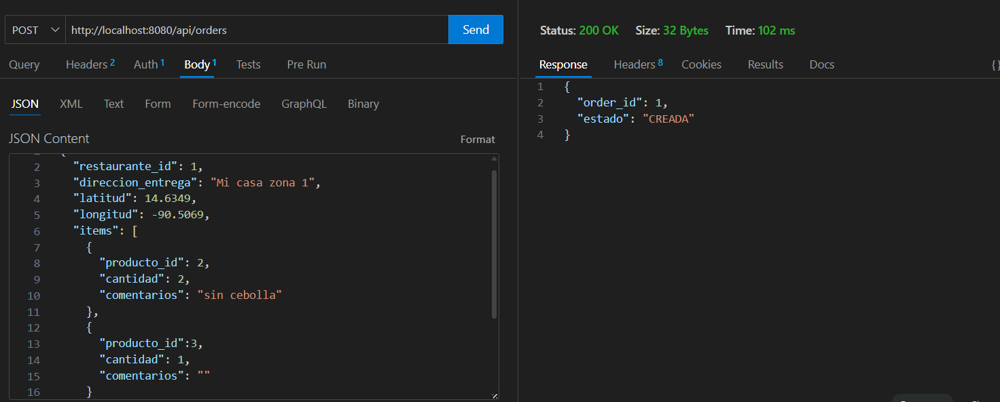

### Exito 2: 

En esta prueba se envio al servidor api-gateway una orden como solo un producto. 
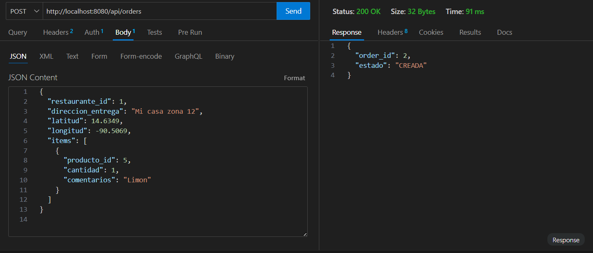

### Exito 3: 

Tercera prueba con resultado exitoso que se realizo utilizando thunder client para la prueba del endpoint. Un solo producto con informacion extra.
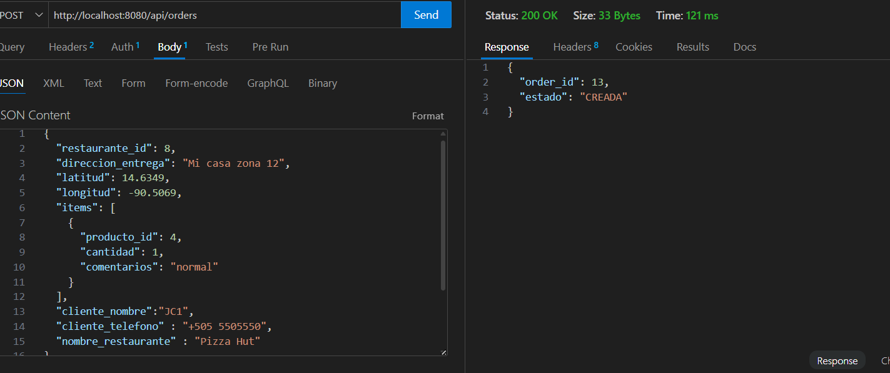

### Exito 4: 

Prueba en el frontend en la que se mando una solicitud con un unico producto, respondio exitosamente. 

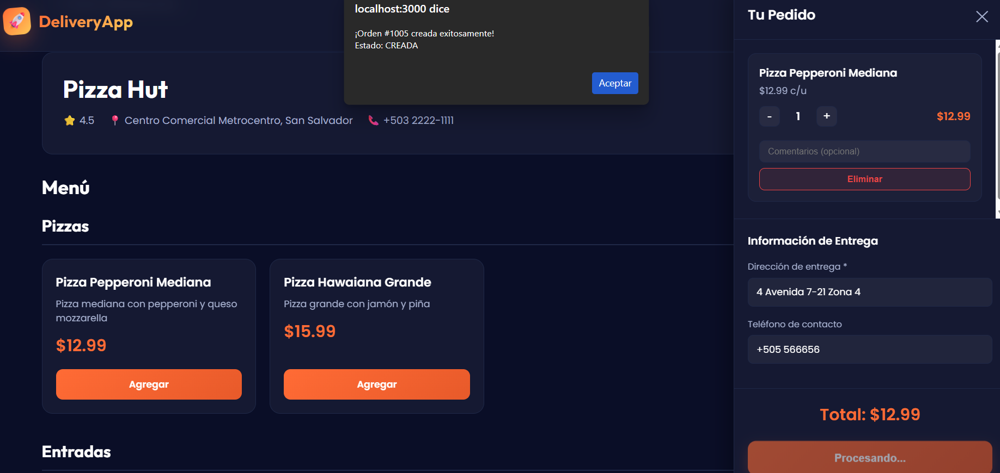

### Exito 5:

Esta respuesta de exito ocurre cuando en el frontend se hace una solicitud de dos productos de diferentes categorias pero del mismo restauratne y tambien con cantidades diferentes.

