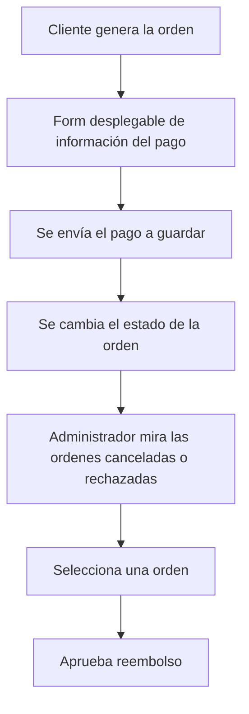

## Pagos y Reembolsos

## Pagos y Reembolsos

El pago consiste en que al momento de realizar una orden, se simula un espacio de pago donde el cliente ingresa los datos respectivos para hacer un deposito (numero de tarjeta, numero en la parte de atrás).

### Pago por parte del cliente

El cliente tendrá que ingresar los datos de información al momento de crear una orden. Estos datos tambien seran guardados en el apartado de pagos.

#### Endpoint para guardar los pagos
```
POST /api/payments
```
request:
```json
{
    "order_id": 3,
    "payment_method": "TARJETA",
    "use_cupon": false,
    "amount": 120.50
}
```
response:
```json
{
    "payment_id": 8,
    "status": "PAGADO",
    "message": "Pago procesado exitosamente"
}
```

### Ordenes canceladas o rechazadas

Durante el proceso de las ordenes estas pueden ser canceladas por el cliente, por el restaurante y por el repartidor. O también pueden ser rechazadas por el restaurante antes de que se empiece su elaboración. 

### Ver ordenes canceladas o rechazadas 

El administrador podrá ver las ordenes que han sido canceladas o rechazadas para aprobar un reembolso del pago a los clientes de estas ordenes.

#### Endpoint ver ordenes canceladas o rechazadas
```
GET /api/orders/cancelled
```
response:
```json
[
    {
        "id": 1,
        "estado": "CANCELADA",
        "cliente_nombre": "Diego Perez",
        "costo_total": 60,
        "motivo": "Me cai"
    },
    {
        "id": 3,
        "estado": "RECHAZADA",
        "cliente_nombre": "Diego Perez",
        "costo_total": 25,
        "motivo": "Orden rechazada por el restaurante"
    }
]
```
### Aprobar reembolso 

El administrador, después de ver las ordenes canceladas o rechazadas, podrá seleccionar una para aprobar un reembolso el cual cambiara el estado de su orden a "REEMBOLSADO".

```
PATCH /api/payments/:id_orden/refund
```
response:
```json
{
    "success": true,
    "message": "Pago reembolsado correctamente"
}
```

### Flujo de pagos


